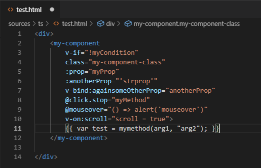
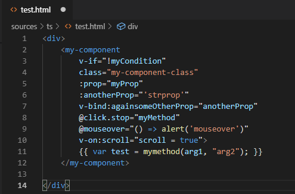

# Intro

This project provide vuejs synthax coloration for simple HTML files in VsCode. This can be very usefull if you are using typescript with "vue-template-loader" and "vue-property-decorator". As long as the Template is separated from the implementation, no pluggin can manage synthax coloration. This will apply a "vetur" like coloration. 
**Caution**: this will be applied to all your html files  

**before**
  
**after**

# Intall

1) Clone the repo 
2) run "npm install" 
3) Create your own VSIX installer (https://code.visualstudio.com/api/working-with-extensions/publishing-extension) 
4) Install the VSIX on your VsCode 

# Source 

This was inspired by  
https://github.com/vuejs/vue-syntax-highlight