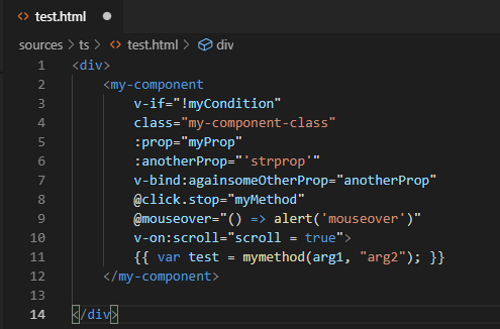

# Intro

This project provide vuejs synthax coloration for simple HTML files in VsCode. This can be very usefull if you are using typescript with "vue-template-loader" and "vue-property-decorator". As long as the Template is separated from the implementation, no pluggin can manage synthax coloration. This will apply a "vetur" like coloration.<br/>
**Caution**: this will be applied to all your html files<br/><br/>

**before**<br/>
<br/><br/>
**after**<br/>


# Intall

```
1) Type "Vue HTML syntax highlighter" on market place
2) Install the extension
```


# Source 

This was inspired by<br/> 
https://github.com/vuejs/vue-syntax-highlight